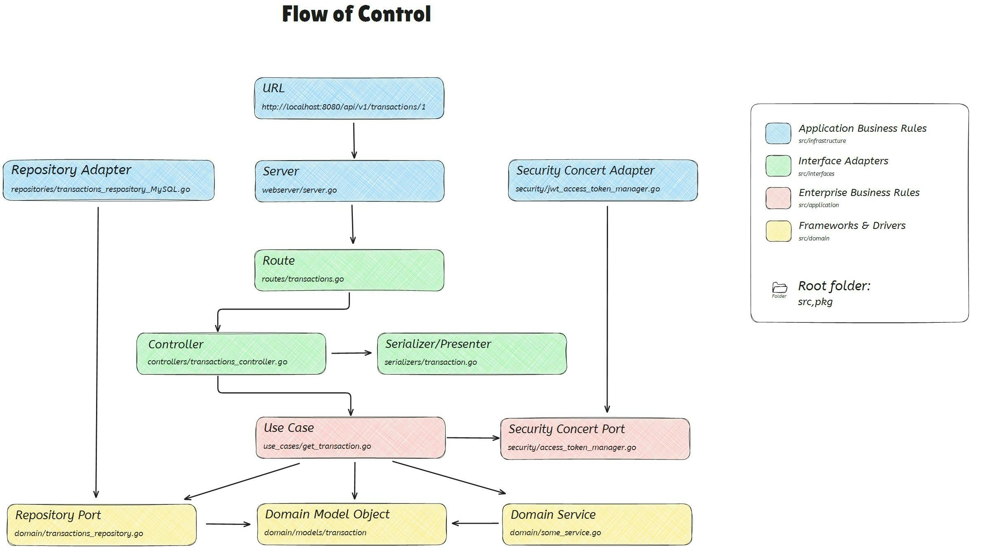

# Clean Architecture with Go

This project is an example of Clean Architecture implemented in Go. It follows the principles established by Uncle Bob and Domain-Driven Design (DDD) to achieve clear separation of responsibilities and long-term maintainability.

## Table of Contents

- [Prerequisites](#prerequisites)
- [Project Structure](#project-structure)
- [Quick Start](#quick-start)
- [Clean Architecture](#clean-architecture)
- [Use Cases](#use-cases)
- [Flow of Control](#flow-of-control)
- [Dependency Rule](#dependency-rule)
- [Testing](#testing)
- [Changelog](#changelog)

## Prerequisites

Before starting, make sure you have the following components installed:

- Go 1.20 or higher
- Git

## Project Structure

The folder structure follows Clean Architecture principles, where each layer is decoupled from the others, ensuring that implementation details can change without affecting the business logic.

```
.
├── cmd                     # Application entry point
│   └── api
│       ├── bootstrap        # Web server initialization
│       └── main.go          # Main file
├── go.mod                   # Project dependencies
├── src                      # Main source code
│   ├── application          # Application logic layer (Use Cases, DTOs)
│   ├── domain               # Domain layer (Entities, Repositories, Business Rules)
│   ├── infrastructure       # Repository implementations and web server configuration
│   └── interfaces           # Controllers and routing
└── test                     # Tests (TDD and BDD)
```

## Quick Start

Follow these steps to clone and run the project locally:

```bash
git clone <repository-url>
cd <repository-folder>
go mod tidy
go run cmd/api/main.go
```

Then, open [http://localhost:8080](http://localhost:8080) in your browser to test the API.

## Clean Architecture

This project follows **Clean Architecture** and **DDD** principles. The layer separation ensures that business rules are independent of frameworks, user interfaces, databases, or any other external service.

## Clean Architecture layers
The application follows the Uncle Bob "[Clean Architecture](https://8thlight.com/blog/uncle-bob/2012/08/13/the-clean-architecture.html)" principles and project structure :


### Architecture Layers

- **Domain**: Contains the business entities and repository interfaces. It's the core of the application.
- **Application**: Implements the use cases that orchestrate the business logic.
- **Infrastructure**: Provides the concrete implementations of repositories and service configurations such as databases and web servers.
- **Interfaces**: Defines the controllers and routes to handle external interaction with the system.

## Use Cases

**Use Cases** are responsible for executing the business logic by interacting with the **Domain** through repositories. Each use case is located in the `src/application/use_cases` folder.

Example of a use case for creating a user:
```go
type CreateUserUseCase struct {
userRepository domain.UserRepository
}

func (uc *CreateUserUseCase) Execute(input CreateUserDTO) (User, error) {
// Business logic for creating a user
}
```

## Flow of Control

The flow of control in this architecture starts from the controller, which invokes a use case. The use case accesses domain entities and repositories to apply the business logic.



## Dependency Rule

The **Dependency Rule** states that dependencies must always point inward. This means that the **Domain** should not know anything about the outer layers like **Infrastructure** or **Interfaces**.

```
https://blog.cleancoder.com/uncle-bob/2012/08/13/the-clean-architecture.html#the-dependency-rule
```

## Testing

The tests are divided into BDD (Behavior-Driven Development) and TDD (Test-Driven Development).

- **BDD**: Used to validate entire use case scenarios. These are located in `test/bdd`.
- **TDD**: Unit tests for use cases and entities are found in `test/tdd`.

### Running the tests

To run both BDD and TDD tests:

```bash
go test ./test/...
```

## Changelog

The changelog is located in the [CHANGELOG.md](CHANGELOG.md) file, where you can find details about previous versions and newly implemented features.

---

This README is designed to provide an overview of the project and guide developers in its usage and understanding of the implemented architecture.
